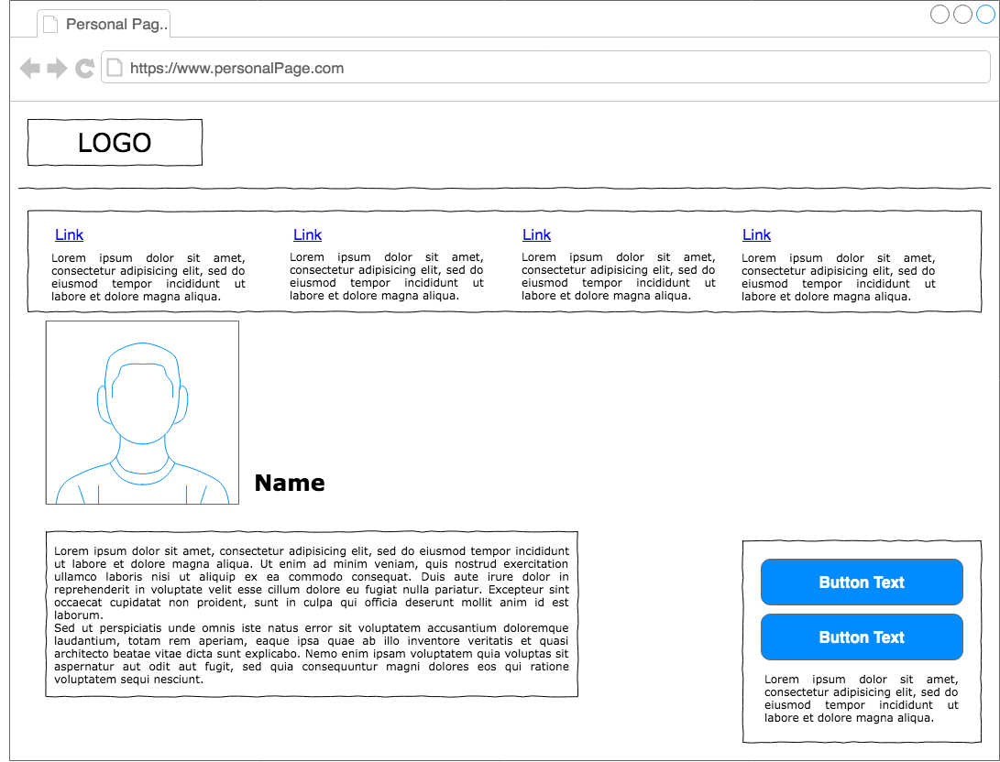
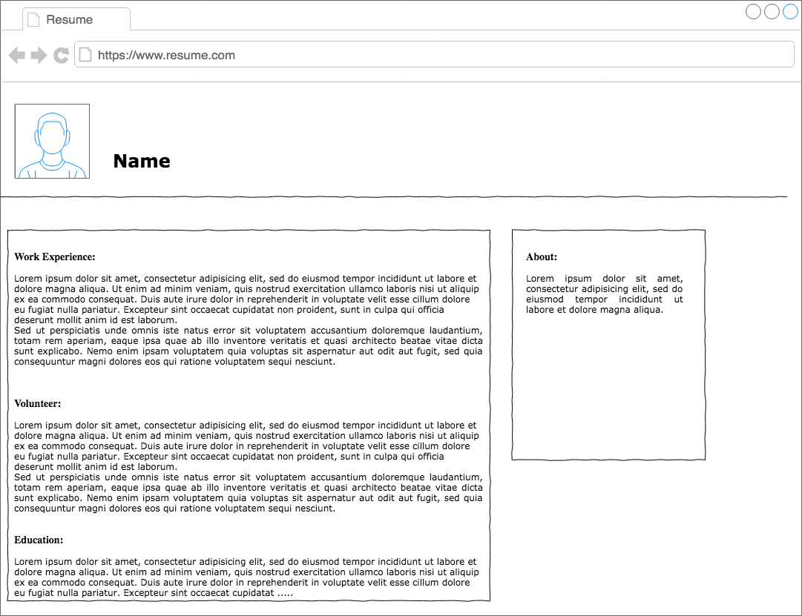
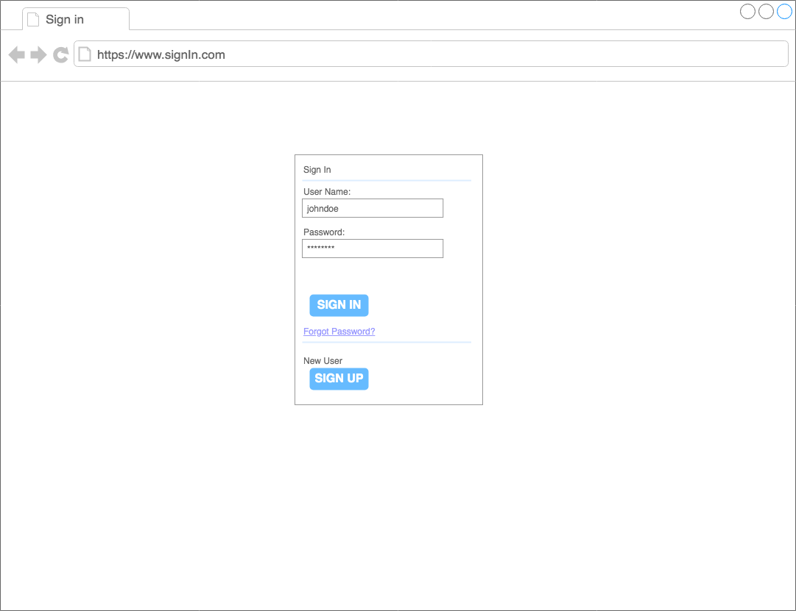
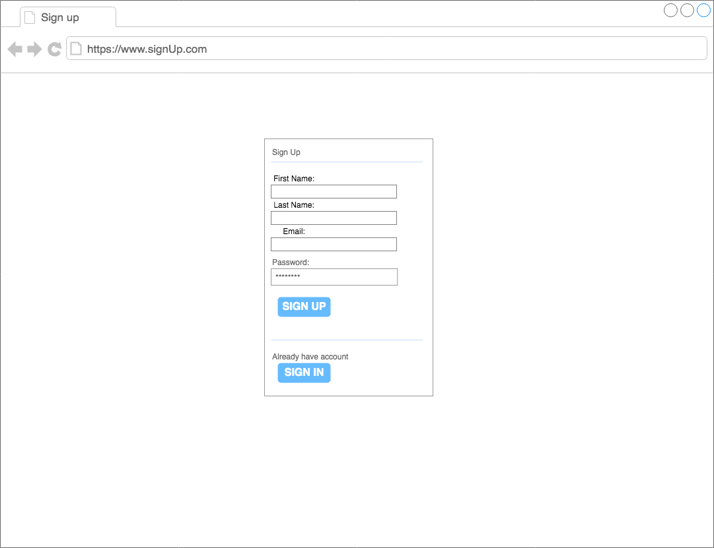
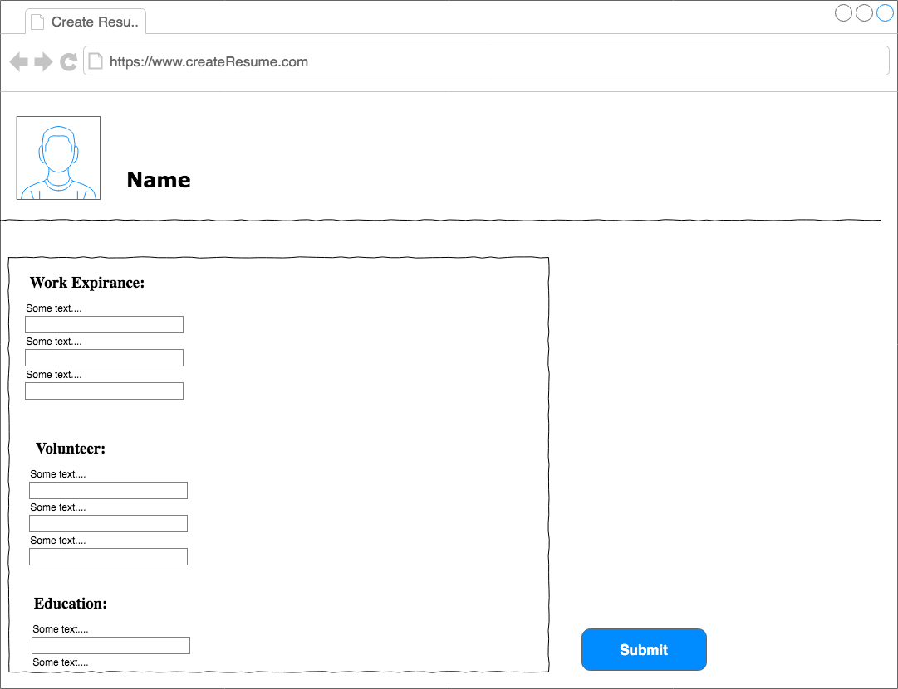
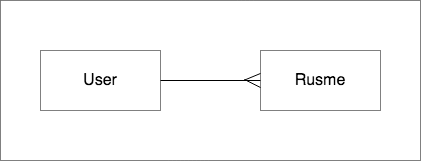
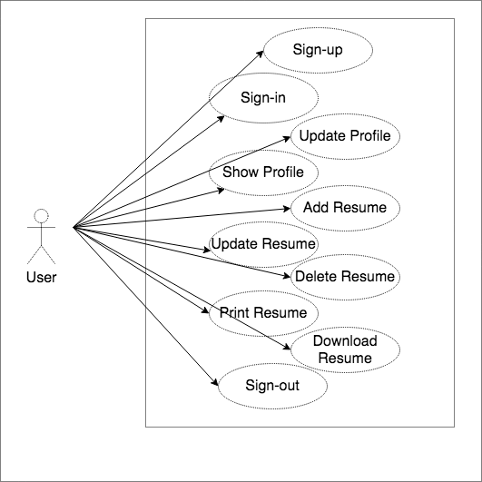

### Descriprtion :
It is a Full-Stack MERN web application that allow user to have a personal page where the user can build one or more professional resume to save it in the website, download it and print it.

### User Stories :
- As a user, I want to register so that I have my page.
- As a user, I want to log in so that I have access to my page.
- As a user, I want to manage my page so that I can add, view, or update my information.
- As a user, I want to add my professional resume so that I can print or download it.
- As a user, I want to manage my professional resume so that I can update or delete it.

### Tools :
CSS
React.JS.
express.Js. node.JS.
mongoose.
cors.
React-bootstrap.
firefox.
chrome.
postman.
vs code.
Trello.
draw.io.
Axios.

#### The Wireframe :

#### UseCase and UML

